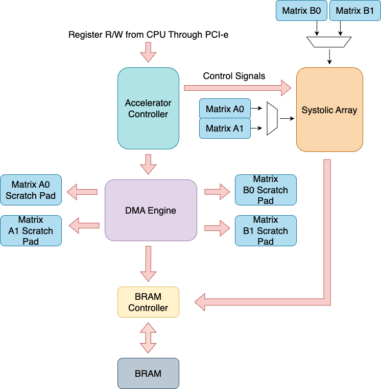
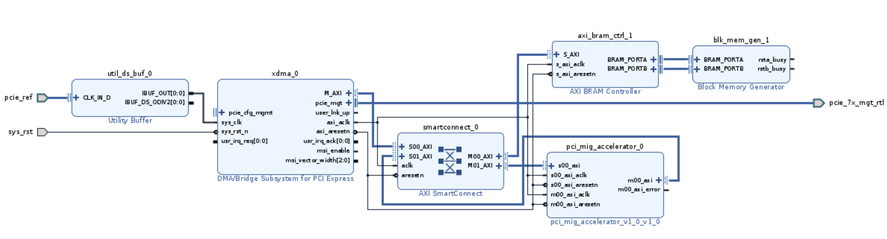

# ViT-FPGA-TPU v2.0
FPGA based Vision Transformer accelerator (Harvard CS205)

## Contribution:
|Name |Contribution|
|-----------|--------------------------------------------------------------------------|
| Eric      | FPGA Matrix Multiplication Design + Code, SW/HW Co-Design                |
| Hongyi    | ViT on Pytorch C++, SW/HW Co-Design and Integration                      |
| Wenyun    | ViT on Pytorch C++, Test and Benchmark (and corresponding shell scripts) |
| Sebastian | ViT and FPGA literature research, FPGA demo + testing                    |
